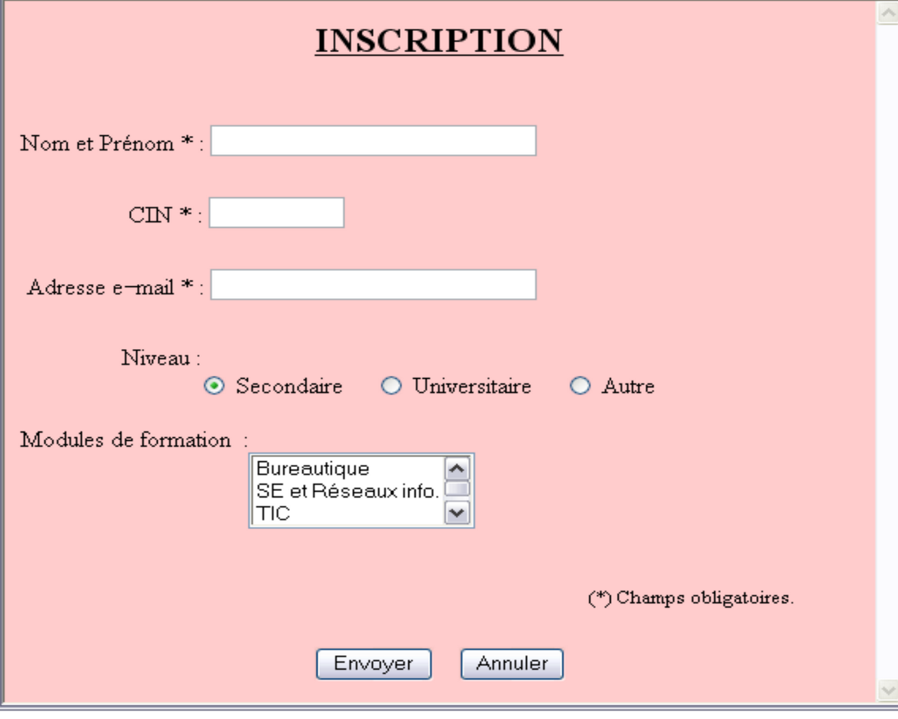

# TD 2

## Init

Récupérez le code : ```git clone url```

Créez votre propre branche : ``git branch -b newBranch``

Résoudre les exercices en les mettant dans le bon dossier :
- Exercice1
- Exercice2
- Exercice3

Une fois votre td terminé :
- Ajoutez vos fichiers dans l'index + message du commit (voir cours) : git add /path
- Poussez sur ce repo

## Une belle page !

Intégrez du css sur chaque exercice. Utilisez un framework css. Peu importe (bootstrap, foundation, materialize ...).


## Exercice 1

  

Créer un fichier HTML,intitulé Formation, contenant le formulaire suivant (suivre l'ihm):

Le clic sur le bouton "Envoyer" de type submit fait l'appel à une fonction "Verif" écrite en JavaScript et qui permet de vérifier les conditions suivantes :
- Les champs Nomet Prénom, CIN et Adressee-mail doivent être non vides.
- Le champ CIN ne contient que 8 chiffres de 0 à 9.
- L’adressee-mail doitcomporter le caractère @.
- Le niveau Secondaire est sélectionné par défaut.
- On peut choisir au maximum deux modules de formation.

Si les conditions précédentes sont satisfaites, le message suivant sera affiché : "Inscription achevée!!". Le bouton "Annuler" permet de remettre à vide tous les champs du formulaire.

## Exercice 2

Calculer le salaire d'une personne sur base de son salaire brut en décomptant les frais suivants:

- Impôts sur le revenu : 18%
- Assurance employé : 7%
- Régime de pensions du Canada : 5%

Les personnes peuvent recevoir comme supplément un bonus de 100$ ou une allocation de 150$.

Il est possible de recevoir des réductions sur les impôts sur le revenu sous certaines conditions :

- Si le travailleur est une femme, elle reçoit 2% de réduction.
- Si le travailleur a 3 personnes à charge, il reçoit 1% de réduction.
- Si le travailleur a 4 personnes à charge, il reçoit 2% de réduction.

PS : Le html est déjà tout prêt pour me faire un beau script.js par vos soins :)

## Exercice 3 

Définir l'objet Personne qui contient :
- un nom
- un sexe
- un age
- une nationnalité 

Développer une interface pour créer l'objet personne.
Cette interface doit également être capable de lister les personnes ajouter.
Les champs doivent être vérifié au préalable. Je vous laisse la liberter de mettre les restrictions nécessaires. 

Aide : mettre en place une liste d'objet "Personne" qui sockera les différentes personnes.

Pas besoin de stockage persistant (base de données)
